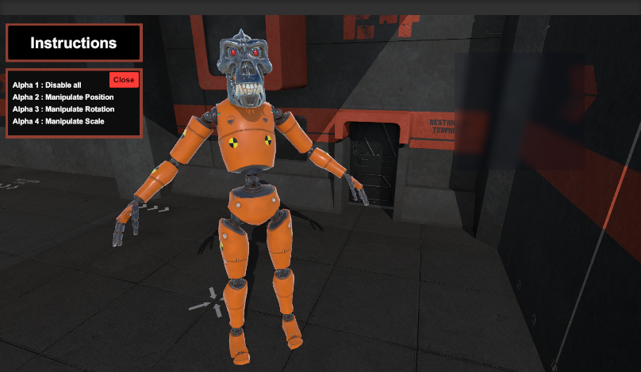

# Drag-and-Drop-object-manipulation

Unity Version : 
* Unity 2020.3.8

Summary :
* Drag and drop object instantiation from 3D button into world space.
* Translation, rotation, and scaling of object on x, y, z axes via gimbal controls and mouse click.

Build instructions :
- Open Package Manager
- Make sure Post Processing v2 is Installed.
- Load up the project with Ease

Scene Overview :
- a Free-cam , you are able to go Up/Down E/Q While Traverseing with your Mouse Look (Hold L-Mouse While Mouse Looking)
- Drag and Drop features
- once the Object is Spawned you are able to Make Changes to the Position, Rotation, Scale 
of the 3D Object Through:
  <pre>
  Keyboard Controls :
   Press 1 => Disabling all visuals.
   Press 2 => Position
   Press 3 => Rotation
   Press 4 => Scale
  </pre>

Preview :
   
